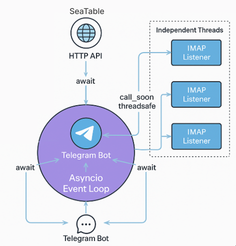

# Телеграм-бот для рассылки отчетов из Superset

## Назначение
Бот позволяет автоматически отправлять отчёты с BI-платформы Apache Superset в телеграм — пользователям и группам через 
технические email-аккаунты. Он реагирует на входящие письма с PDF- и PNG-вложениями, и пересылает отчёты в Telegram.

## Как работает бот
- *Регистрация пользователей:* 
- - Системный администратор добавляет нового пользователя в конфигурационную таблицу Seatable: имя, телефон и ящики, 
с которых пользователь будет получать сообщения.
- - Пользователь запускает бота на своем устройстве. 
- - Бот просит пользователя поделиться номером телефона.
- - Бот обращается по АПИ в Seatable, проверяет, есть ли пользователь с таким телефоном. Если есть, записывает его
id_telegram. 
- - Регистрация завершена. Пользователь получает сообщение, что он подписан на рассылку.
- *Регистрация групп (чатов):* 
- - Системный администратор добавляет название группы и ящики, с которых в группу нужно пересылать вложения.
- - Администратор группы добавляет бота в группу.
- - Администратор группы дает боту права администратора. 
- - Бот обращается по АПИ в Seatable, проверяет, есть ли группа с таким названием. Если есть, записывает ее
id_telegram. При этом ставится блокировка от перезаписи id_telegram чата.
- - Регистрация группы завершена.
- Бот «слушает» ящики через IMAP в режиме IDLE.
- Superset отправляет отчёты на email-ящики.
- Когда приходит письмо с вложением, бот:
  - извлекает тему, а также файлы в формате PDF и PNG;
  - находит нужных Telegram-получателей в базе по email — это отдельные пользователи и/или группы;
  - рассылает отчёт по списку id_telegram.

## Основные компоненты

**Seatable** — конфигурационная база. Используется для хранения параметров доступа и связей между пользователями, 
чатами и ящиками. 

**IMAP Idle Listener** — слушает входящие письма на почтовых ящиках через IMAP IDLE. Каждый ящик запускается в отдельном 
потоке. 

**Telegram Bot** — отвечает на команды пользователей, рассылает вложения из писем.

